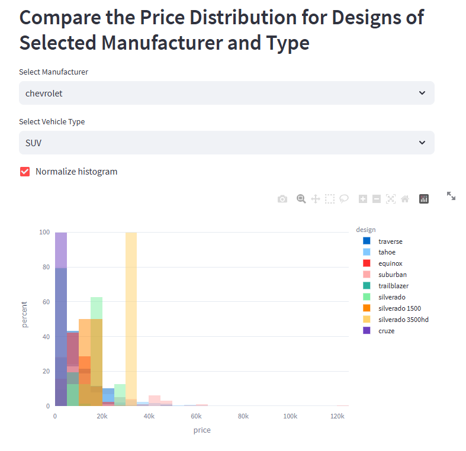

# Sprint 4 Project: Software Development Tools

---

### 📚 Table of Contents
- 🔍 [Project Overview](#project-overview)
- 📈 [Conclusion](#conclusion)
- 🖼️ [Sample Outputs](#sample-outputs)
- 📁 [Files](#files)

---

## Project Overview

This project aims to provide you with additional practice on common software engineering tasks. These tasks will augment and complement your data skills, and make you a more attractive job candidate to potential employers. 

You will be asked to develop and deploy a web application to a cloud service so that it is accessible to the public.

In this project, we will provide you with the dataset on car sales advertisements, which you’ve already worked with in the past.

The project is split into several steps that replicate the process described in our blog post here, but we will be using the Render platform instead of Heroku.
https://www.tripleten.blog/posts/deploying-data-science-web-apps-to-the-cloud

---

## Conclusion

The data reveal a few interesting suggestions for car buyers. If you're looking for an inexpensive car that runs for many miles, Acura is a good manufacturer to consider. Similarly, mini-vans, wagons, and vans appear to be good value vehicle types. New vehicles are reliably the most expensive, but classics can have prices nearly as high. Vehicles since around 1985 can handle more miles and take longer to sell.

Price, odometer, make, type, and model year are all worthwhile variables to investigate. Condition is a boring independent variable because its insights are obvious: new cars cost more and have fewer miles than old cars. Days listed is also less useful than the other dependent variables because it varies little between categories.

---

## App Repository

This project includes a Streamlit web app for exploring vehicle advertisement data.

- GitHub App Repo: [uberbeek/sprint4-project](https://github.com/uberbeek/sprint4-project)
- Live Render App: [sprint4-project-oe3w.onrender.com](https://sprint4-project-oe3w.onrender.com)

See that repository for full app code, deployment instructions, and README.

---

## Sample Outputs

Here are two key moments from the analysis:

  
*Histogram of odometer values by vehicle type, with optional outlier filtering.*

 

  
*Normalized price distribution for Chevrolet SUVs by vehicle design.*

---

## Files

📄 See the full analysis in [`sprint-04-project.ipynb`](./sprint-04-project.ipynb)  
📄 Or view a static version in [`sprint-04-project.html`](./sprint-04-project.html)  
📄 Project background: [`project-description.md`](./project-description.md)
📄 App repo: [`sprint4-project`](https://github.com/uberbeek/sprint4-project)

> Note: This project uses one CSV file, which is included in the `/data/` folder.  
> See [`/data/README.md`](./data/README.md) for details.
